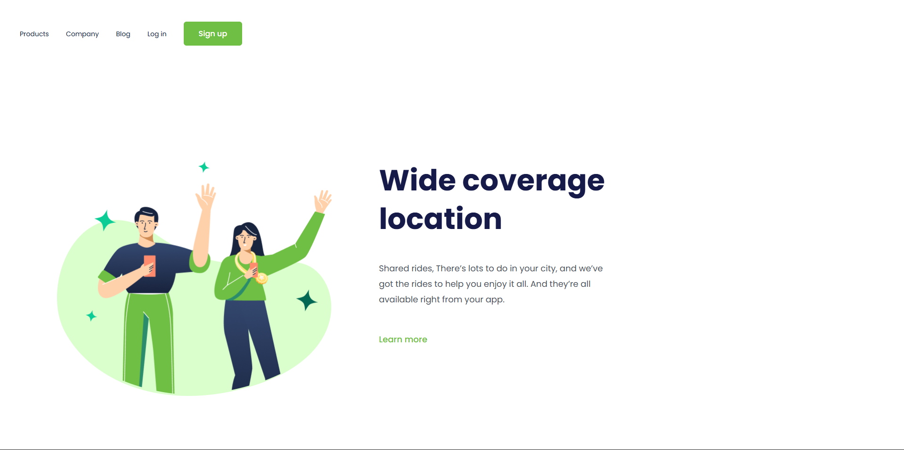

<h1>Primeiro projeto</h1>
 

Esse foi meu primeiro projeto com a utilização de HTML e CSS, aprendido através do módulo de CSS aprendido dentro do <a href="https://www.devclub.com.br/">Devclub</a>.
 

O projeto é apenas a interface de um site feito para desktops, feito para práticar a modelagem de sites com HTML e CSS aprendidas nos módulos do Devclub.

